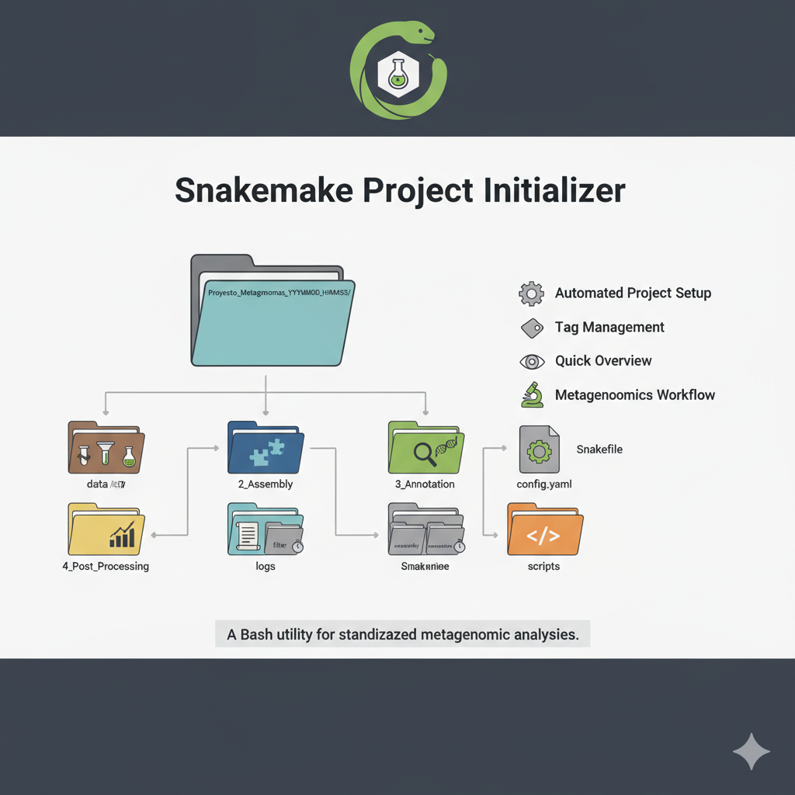

# Snakemake Project Initializer

A Bash utility to create and manage standardized, timestamped project directories for Snakemake-based metagenomic analyses.




## Features

- **Automated Project Setup**: Creates standardized directory structure with timestamps
- **Tag Management**: Assign and track projects using extended attributes (`user.tags`)
- **Quick Overview**: List all projects with their associated tags
- **Snakemake Integration**: Pre-configured with Snakefile and config.yaml templates
- **Metagenomics Workflow**: Optimized for metagenomic analysis pipelines

## Directory Structure

Each new project follows this organized structure:

```
Proyecto_Metagenomas_YYYYMMDD_HHMMSS/
├── data/                    # Raw input data
├── 1_Filtered/             # Filtered/QC'd data
├── 2_Assembly/             # Assembly results
├── 3_Annotation/           # Functional annotation
├── 4_Post_Processing/      # Final analysis results
├── logs/
│   ├── filter/             # Filtering logs
│   ├── assembly/           # Assembly logs
│   └── annotation/         # Annotation logs
├── scripts/                # Custom scripts
├── config.yaml             # Project configuration
└── Snakefile              # Snakemake workflow
```

## Installation

```bash
# Download the script
curl -O https://raw.githubusercontent.com/yourusername/yourrepo/main/init_project.sh

# Make executable
chmod +x init_project.sh
```

## Usage

### Create a New Project

```bash
# Basic project creation
./init_project.sh new

# Create project with tag
./init_project.sh new --tag "araucaria1"

# Create project in custom location
./init_project.sh new --path /mnt/data/metagenomes/ --tag "forest_soil"
```

### List Existing Projects

```bash
# List projects in current directory
./init_project.sh list

# List projects in custom path
./init_project.sh list --path /mnt/data/metagenomes/
```

### Get Help

```bash
./init_project.sh --help
```

## Configuration

The script automatically generates a `config.yaml` file:

```yaml
# --------------------------
# Project configuration file
# --------------------------
SAMPLES: ["sample1", "sample2"]
N_THREADS: 8
ASSEMBLY_TOOL: "megahit"
EGGNOG_DB: "/path/to/eggnog_db"
```

## Tag System

Projects can be tagged using Linux extended attributes for easy organization:

```bash
# Set tag during creation
./init_project.sh new --tag "experiment_A"

# Verify tag
getfattr -n user.tags Proyecto_Metagenomas_20251015_102412/

# List all projects with tags
./init_project.sh list
```

## Dependencies

- **Bash** 4.0 or higher
- **Snakemake** (for workflow execution)
- Linux filesystem with extended attribute support
- Common bioinformatics tools (Megahit, EggNOG, etc.)

## Workflow Integration

The generated Snakefile provides a template for metagenomic analysis:

```python
# Snakefile (Simplified Template)
import os
from snakemake.io import expand

configfile: "config.yaml"

SAMPLES = config["SAMPLES"]
THREADS = config["N_THREADS"]
ASSEMBLY = config["ASSEMBLY_TOOL"]

rule all:
    input:
        expand("4_Post_Processing/{sample}_EC_counts.tsv", sample=SAMPLES)
```

## Version

**Current Version**: 1.3.0

## Author

**Sergio Litwiniuk** with AI contribution.
- Email: sergiolitwiniuk@gmail.com
- GitHub: [@sergiolitwiniuk85](https://github.com/sergiolitwiniuk85)


## License

This project is licensed under the MIT License - see the LICENSE file for details.

## Contributing

1. Fork the repository
2. Create a feature branch (`git checkout -b feature/amazing-feature`)
3. Commit your changes (`git commit -m 'Add some amazing feature'`)
4. Push to the branch (`git push origin feature/amazing-feature`)
5. Open a Pull Request

## Support

For issues and questions:
1. Check the help menu: `./init_project.sh --help`
2. Review the generated project structure
3. Open an issue on GitHub with your error details

---

**Note**: This tool is specifically designed for metagenomic analysis workflows but can be adapted for other Snakemake-based bioinformatics projects.
